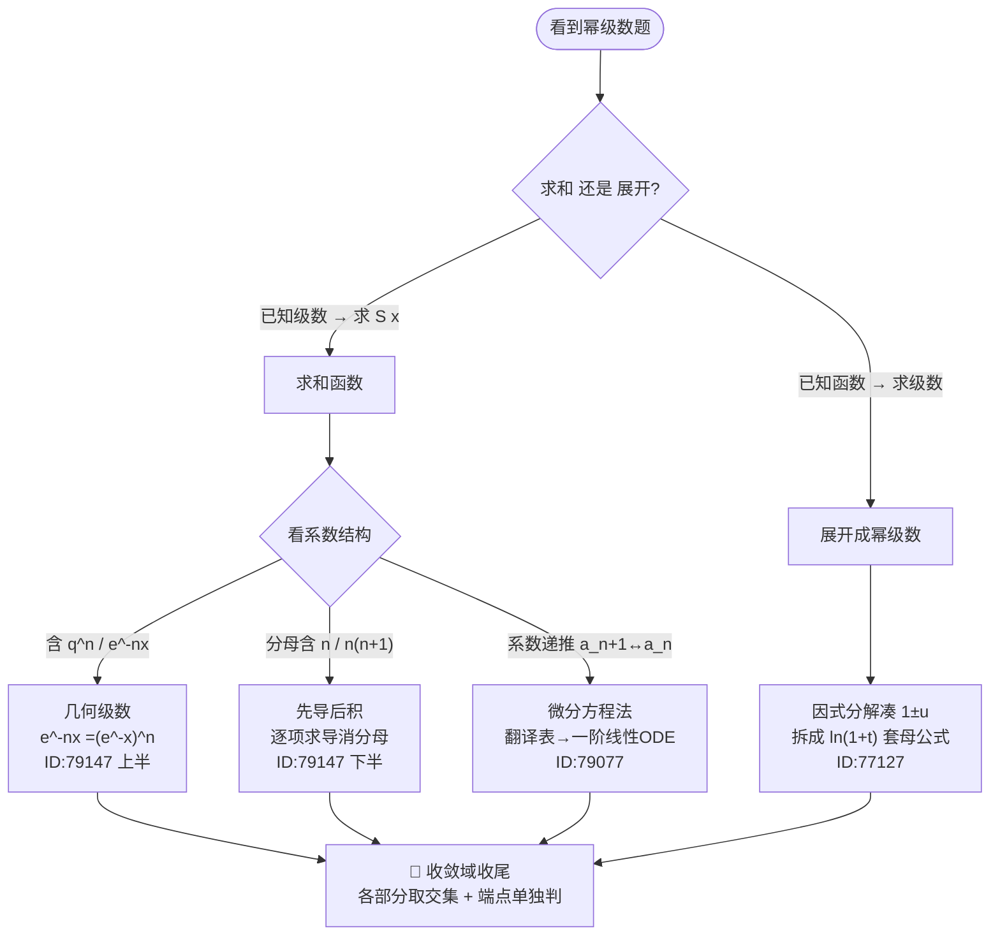

# 🎯 2026-06-18 数学复盘 · 幂级数（求和 ↔ 展开）专题

> 今天 3 道题、1 条主线、4 张反射卡、1 组符号坑。慢慢看完约 **11 分钟**。
> （Obsidian 打开本文件可直接渲染下方 Mermaid 图）
> 注：下列掌握度为 GPT 估分，**待你自评确认**。

---

## ① 30 秒概览 · 今日掌握度

```text
GS-611 · ID:79147  拆级数 几何+积分型     █████░░░░░  2.5/5   难度4·四处动作连断
GS-545 · ID:79077  递推系数 微分方程法     ██████░░░░  3.0/5   ← 第2次·复发(06-04→06-18) 2→3
GS-612 · ID:77127  对数二次式 展开         █████░░░░░  2.5/5
────────────────────────────────────────────────────────
今日平均                                  █████▌░░░░  2.67/5  「入口会·执行链待稳」档
```

一句话：**3 题全是「幂级数」，是"求和 ↔ 展开"一对逆运算；方法主线（入口）全对（都判 B 类），全断在执行细节 —— 收敛域、符号方向、重编号。**

---

## ② 一张图看懂今天（幂级数双向决策流）



---

## ③ 3 题速览（触发 → 第一动作 → 断点 → 结论）

| # | 题（题源） | 看到什么（触发） | 第一动作 | 断点 | 结论 |
|---|---|---|---|---|---|
| 1 | GS-611 · ID:79147 | `e^{-nx}+x^{n+1}/n(n+1)` 求收敛域和和函数 | 拆 `S₁=Σe^{-nx}`、`S₂=Σx^{n+1}/n(n+1)` 分别处理 | 🔗B7 计算链 ×4 | 收敛域 `(0,1]`，`S=1/(eˣ-1)+(1-x)ln(1-x)+x` |
| 2 | GS-545 · ID:79077 | 系数递推 `(n+1)a_{n+1}=(n+½)a_n` 求和 | 设 `S`，递推→`S,S'` 一阶线性 ODE | 🔗B4 动作链（**复发第2次**） | `S(x)=2/√(1-x)−2`，`|x|<1` |
| 3 | GS-612 · ID:77127 | `ln(1−x−2x²)` 展成幂级数 | 因式分解凑 `(1+x)(1−2x)` 拆 `ln` | 🎯B3 方法走偏（因式分解目标） | `Σ[(−1)ⁿ⁻¹−2ⁿ]/n·xⁿ`，`(−½,½)` |

---

## ④ 今日知识网络

```mermaid
mindmap
  root((今日<br/>幂级数<br/>3 题))
    求和函数
      ID:79147 几何+先导后积
      ID:79077 递推→微分方程法
    展开成幂级数
      ID:77127 ln二次式凑母公式
    共性断点·要固化
      收敛域 取交集+端点单独判 ×3
      符号/方向 稳定性 ×2
      重编号翻译表 na_n·x^n=xS'
      通项趋零这一关 x=0
    母公式
      5 个常用展开式
      ln(1+t) 今日核心
```

---

## ⑤ 4 张「动作反射卡」+ 1 组符号坑

**🎴 反射卡① 收敛域收尾三件套**（⚡今日 3 题全踩）
求和 / 展开写完母公式 **不算完**：① 多部分**取交集**（方向别反，ID:79147 把 `(0,1]` 写成了 `[-1,0]`）；② 端点 `x=±R` **单独代回**判；③「代换公式适用开区间」≠「所得幂级数端点收敛性」，分清后按题库口径写（ID:77127 这里 `(−½,½)` vs `[−½,½)`）。

**🎴 反射卡② 求和函数认结构**（看一眼系数就分流）
- 看到 `e^{-nx}` / `q^n` → 先改写 `(e^{-x})^n` 当**几何级数**
- 分母含 `n` / `n(n+1)` → **先导后积**（逐项求导消分母）
- 系数**递推** `(n+1)a_{n+1}` 与 `a_n` → **微分方程法**

**🎴 反射卡③ 递推系数翻译表**（ID:79077 复发第 2 次 → 背死）
`(n+1)a_{n+1}xⁿ ↔ S'(x)` ｜ `n·aₙxⁿ ↔ xS'(x)`（**不是** `nS(x)`）｜ `aₙxⁿ ↔ S(x)`
配套三动作：求导**重编号后先拆首项 a₁** → 主语**盯住在算 S 还是 S′** → 解完立刻 `S(0)=0` 定 `C`。

**🎴 反射卡④ 通项趋零这一关**（呼应 06-15 反射卡①）
端点（尤其 `x=0`）"代入有值" ≠ 收敛！`x=0` 处 `e^{-nx}=1` → `Σ1` 通项不趋零 → **直接发散**。任何端点先查 `lim uₙ`。

**⚠️ 符号 / 方向坑（今日栽 3 次，单独拎出来）**
- 解 `e^{-x}<1`：指数单调递增 ⇒ `x>0`（**别判反成 x<0**）
- 记死 `∫₀ˣ −ln(1−t)dt = (1−x)ln(1−x)+x`（ID:79147 这里符号飘了）
- 一阶线性化标准式 `y'+Py=Q`，`Q` 别写成负号；`∫(1−x)^{-1/2}dx = −2√(1−x)` 带**链式负号**

---

## ⑥ 3 分钟自测（先合上答案）

1. 看到 `e^{-nx}` 求和，第一动作是什么？解 `e^{-x}<1` 得什么？
2. 级数端点 `x=0` 处通项 `=1`，收敛吗？为什么？
3. 求和函数三种系数结构各走什么方法？（`q^n` / 分母含 `n(n+1)` / 系数递推）
4. 翻译表：`Σn·aₙxⁿ = ?`（**不是**什么？）
5. 展开 `ln(1−x−2x²)`，第一步做什么？能不能把负常数提出去？
6. 收敛域收尾必做哪两件事？

<details>
<summary>👉 答案钥匙</summary>

1. 改写 `(e^{-x})^n` 当几何级数；指数单调递增 ⇒ `x>0`。
2. 发散；通项 `=1` 不趋零，违反收敛必要条件（过不了第一关）。
3. 几何级数求和 / 先导后积 / 微分方程法。
4. `xS'(x)`；**不是** `nS(x)`。
5. 先因式分解凑 `(1+x)(1−2x)` 再拆 `ln(1+t)`；**不能**提负常数（会写出 `ln(−2)` 实数无意义）。
6. 各部分**取交集** + 端点**单独判**。

</details>

---

## ⑦ 下次复做安排

- **今日 3 题均排明天 06-19 第一次复做**（间隔 1 天，count 0）。其中 **GS-545 · ID:79077 是复发第 2 次**（06-04 → 06-18），优先盯——专攻反射卡③ 翻译表。
- **母题强烈建议补一遍**：**GS-544 · ID:78933「幂级数收敛域和函数」**——它是今日 3 题共同的关联节点，正好针对今天 #1 弱点「收敛域收尾」。

---

> **今日一句话收尾**：幂级数求和与展开是一对逆运算，入口你都会了；现在差的全是收尾功夫——**取交集、判端点、稳符号、记牢翻译表**。把"收敛域收尾三件套"练成本能。
