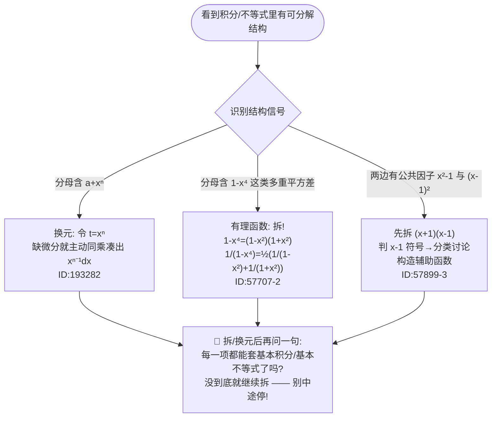
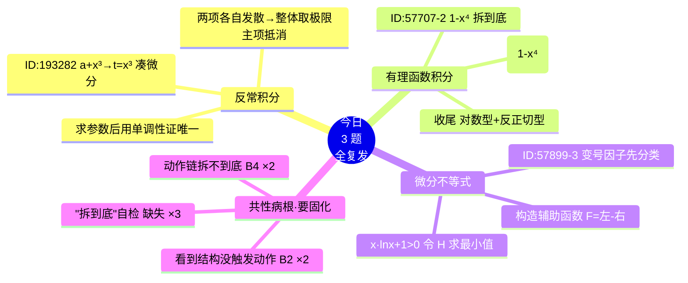

# 🎯 2026-06-24 数学复盘 · 「看到结构 → 拆到底」专题（三连复发）

> 今天 3 道题、**全是复发第 2 次**、1 条主线、4 张反射卡、1 组符号坑。慢慢看完约 **12–14 分钟**。
> （Obsidian 打开本文件可直接渲染下方 Mermaid 图）
> 注：下列掌握度按本次复做结果回滚自评，已写入回滚系统。

---

## ① 30 秒概览 · 今日掌握度

```text
GS-587 · ID:193282   含参广义积分 换元凑微分    ████░░░░░░  2.0/5  ← 复发第2次(06-09→06-24)  3→2
GS-604 · ID:57707-2  有理函数 分式拆分到底      ████░░░░░░  2.0/5  ← 复发第2次(06-13→06-24)  3.5→2
GS-492 · ID:57899-3  变号因子 分类+辅助函数      ████░░░░░░  2.0/5  ← 复发第2次(05-23→06-24)  3→2
──────────────────────────────────────────────────────────────
今日平均                                       ████░░░░░░  2.0/5  「入口想得到·拆不到底」档
```

一句话：**今天 3 题表面分属"反常积分 / 不定积分 / 微分不等式"三个章节，骨子里是同一个病——看到一个"明显可以拆/可以换元"的代数结构，却没有把这个动作触发出来、或没有拆到底。三题全是复发，全降到 2 分。**

---

## ② 一张图看懂今天（"结构信号 → 动作 → 拆到底"主线）



> **今天三题就败在最后这个 Z 框**：要么没进框（193282、57899-3 没触发动作），要么进了框却提前出框（57707-2 拆到一半停）。

---

## ③ 3 题速览（触发 → 第一动作 → 断点 → 结论）

| # | 题（题源） | 看到什么（触发） | 第一动作 | 断点 | 结论 |
|---|---|---|---|---|---|
| 1 | GS-587 · ID:193282 | `∫₁^{+∞} dx/(x(a+x³))=⅓ln2` 求 a | 分子分母同乘 `x²` 凑 `x²dx`，令 `t=x³` | 🎯B2 触发（看到 a+x³ 没想到换元，**复发第2次**） | `a=1`（再用 `φ(a)=ln(a+1)/a` 递减证唯一） |
| 2 | GS-604 · ID:57707-2 | `∫ dx/(x²(1-x⁴))` | 同乘 `x²` → `1/x²+x²/(1-x⁴)`，再拆到底 | 🔗B4 链断（入口对了，**拆到一半停**，从B3进步到B4） | `-1/x+¼ln|(1+x)/(1-x)|-½arctan x+C` |
| 3 | GS-492 · ID:57899-3 | 证 `(x²-1)ln x≥(x-1)²`（x>0） | 拆 `(x+1)(x-1)`，按 `x-1` 符号分三类 | 🎯B2 触发 + 🔗B4 收尾（变号没分类 + `x·lnx+1>0` 不会证） | 构造 `F(x)=(x+1)ln x-(x-1)`，由 `F'>0,F(1)=0` 得证 |

---

## ④ 今日知识网络



---

## ⑤ 4 张「动作反射卡」+ 1 组符号坑

**🎴 反射卡①　结构信号 → 第一动作（今日核心，背成条件反射）**
| 看到这个结构 | 立刻做的第一动作 |
|---|---|
| 分母 `a+xⁿ`（a+x³、a+x²…） | 令 `t=xⁿ`；若缺 `xⁿ⁻¹dx`，**主动分子分母同乘** 凑微分 |
| 分母 `1-x⁴`（多重平方差） | 拆！`1-x⁴=(1-x²)(1+x²)`，`1/(1-x⁴)=½(1/(1-x²)+1/(1+x²))` |
| 不等式两边公共因子 `x²-1`、`(x-1)²` | 先 `(x+1)(x-1)`，再按 `x-1` 正负**分类**，禁止直接约去 |

**🎴 反射卡②　「拆到底」自检（⚡今日 3 题全踩，最该练）**
拆 / 换元写到一半时，**停下来问一句**：
> 「我现在每一项，都能直接套**基本积分表 / 基本不等式**了吗？」
- 还出现 `1/(1-x⁴)`？→ 没到底，继续拆成 `1/(1-x²)+1/(1+x²)`。
- 还出现 `x·ln x+1` 判不了正负？→ 没到底，令 `H(x)=x·ln x+1` 求最小值。
- 到底的标志：剩下的全是 `1/x²`、`1/(1±x²)`、`1/(1+x²)`、`-1/x`、`F(1)=0` 这种"一眼能写出结果"的形。

**🎴 反射卡③　变号因子三步（ID:57899-3 复发 → 背死）**
不等式 / 方程要**除以含 x 的因子**前，按顺序问：
1. 它可能为 **正 / 负 / 零** 吗？→ 本题 `x-1` 在 `0<x<1` 为负、`x=1` 为零、`x>1` 为正；
2. 先写**分类依据**（`0<x<1 / x=1 / x>1`），再做不等式变形；
3. 负的一侧除完**不等号反向**。绝不先约掉再补想符号。

**🎴 反射卡④　两个小工具（今天各卡了一次）**
- **凑微分同乘**：想令 `t=xⁿ` 却缺 `xⁿ⁻¹dx`？分子分母**同乘** `xⁿ⁻¹`，把它整体并进 `dt`。（193282：同乘 `x²` → `x²dx=⅓dt`）
- **判 `x·ln x+1>0`**：令 `H(x)=x ln x+1`，`H'(x)=ln x+1=0 ⇒ x=1/e`，最小值 `H(1/e)=1-1/e>0`，故恒正。（57899-3 第2断点）

**⚠️ 符号 / 收尾坑（今日各栽一处，单独拎出来）**
- 反常积分 `∫(1/t - 1/(a+t))dt`：两项**各自发散**，不能单独拆！必须**整体取极限** `lim_{A→∞}[ln(t/(a+t))]₁^A`，主项 `ln A` 抵消才收敛。（193282）
- `∫dx/(1-x²)=½ln|(1+x)/(1-x)|`，再带前面的系数 `½` → 最终是 `¼`，**系数别丢**。（57707-2 收尾）
- `F(x)=(x+1)ln x-(x-1)` 求导：`F'=ln x+(x+1)/x-1=ln x+1/x`，**别忘了 `+1/x`**。（57899-3）

---

## ⑥ 3 分钟自测（先合上答案，自己写出"第一动作"）

1. 看到 `∫₁^{+∞} dx/(x(a+x³))`，第一动作是什么？为什么要同乘 `x²`？
2. `∫ dx/(x²(1-x⁴))`，入口拆成 `1/x²+x²/(1-x⁴)` 后，下一步 **`x²/(1-x⁴)` 怎么拆到底**？
3. 反常积分里出现 `∫1/t dt` 和 `∫1/(a+t) dt`，能不能分别算？正确做法是什么？
4. 证 `(x²-1)ln x≥(x-1)²`，第一动作两件事是什么？除以 `x-1` 要注意什么？
5. 要证 `x·ln x+1>0`，用什么方法？最小值在哪？
6. "拆到底自检"那一句话是什么？

<details>
<summary>👉 答案钥匙</summary>

1. 分子分母**同乘 `x²`** 凑出 `x²dx`，令 `t=x³`（因为 `dt=3x²dx`，没有 `x²dx` 就换不了元）。
2. `x²/(1-x⁴)=(1+x²)/(1-x⁴)-1/(1-x⁴)=1/(1-x²)-½(1/(1-x²)+1/(1+x²))=½/(1-x²)-½/(1+x²)`，分别对应**对数型**和 **arctan 型**。
3. **不能**分别算（各自发散）；要**整体取极限** `lim_{A→∞}[ln(t/(a+t))]₁^A`，主项抵消后收敛。
4. ① 拆 `x²-1=(x+1)(x-1)`；② 按 `x-1` 符号分 `0<x<1 / x=1 / x>1`。`0<x<1` 时除以 `x-1` **不等号反向**。
5. 令 `H(x)=x ln x+1`，`H'=ln x+1=0 ⇒ x=1/e`，最小值 `H(1/e)=1-1/e>0`。
6. 「每一项都能直接套基本积分表 / 基本不等式了吗？没到底就继续拆。」

</details>

---

## ⑦ 下次复做安排

- **GS-587 · ID:193282** → 明天 **06-25** 复做（间隔 1 天）。盯反射卡①「a+xⁿ→换元」+ 反射卡④凑微分同乘。
- **GS-604 · ID:57707-2** → 明天 **06-25** 复做（间隔 1 天）。盯反射卡②「拆到底自检」——你这次入口已对，只差收尾，复做时**强制写完每一步拆分**。
- **GS-492 · ID:57899-3** → **06-27** 复做（回滚间隔算到 3 天）。盯反射卡③变号分类 + 反射卡④判 `x·lnx+1>0`。

**今晚顺手再扫的同类母题（各 1 道，巩固今天三条主线）：**
- 配 193282：**GS-575 · ID:170723**（同"换元触发不敏感"）、**GS-581 · ID:81310**（同"含参反常积分定参数"题型）。
- 配 57707-2：**GS-605 · ID:57707-3**、**GS-609 · ID:57707-5**（同 57707 题组，同"有理函数拆不到底"）。
- 配 57899-3：**GS-491 · ID:57899-2**、**GS-490 · ID:57899-1**（同 57899 题组，辅助函数单调/一阶导难判时换思路）。

---

> **今日一句话收尾**：今天没有一道是"不会的知识"，全是"**该拆没拆 / 拆了没拆到底**"。把反射卡②那句自检——**"每一项都能套基本式了吗？没到底就继续拆"**——练成本能，今天这三道（以及它们背后的一整类题）就稳了。
