# Obsidian 导航图

## 推荐入口顺序

1. [[00-数学一LLMWiki入口]]
2. [[00-数学一 LLM Wiki]]
3. [[MATHWIKI-OVERVIEW-001_数学错题知识库总览]]
4. [[SRC-RAW-SOURCES-MAP_原始资料映射]]
5. [[MATHWIKI-GS-TOPIC-003_高频知识主线总览]]
6. [[MATHWIKI-COVERAGE-001_错题卡全量覆盖索引]]
7. [[MATHWIKI-COVERAGE-MATRIX_错题卡多维编译矩阵]]
8. [[MATHWIKI-KNOWLEDGE-INDEX_知识点簇索引]]
9. [[MATHWIKI-METHOD-INDEX_方法簇索引]]
10. [[MATHWIKI-ERROR-INDEX_错因簇索引]]
11. [[MATHWIKI-ACTION-GAP-INDEX_method_gap动作断点索引]]
12. [[MATHWIKI-SYNTHESIS-001_当前高价值错因与方法缺口]]
13. [[MATHWIKI-GS-TOPIC-004_极限与连续错题总线]]
14. [[MATHWIKI-GS-TOPIC-005_一元函数微分学应用错题总线]]
15. [[MATHWIKI-GS-TOPIC-006_定积分错题总线]]
16. [[MATHWIKI-GS-TOPIC-009_微分方程错题总线]]
17. [[MATHWIKI-GS-TOPIC-010_多元函数与二重积分错题总线]]
18. [[MATHWIKI-GS-TOPIC-011_无穷级数与幂级数错题总线]]
19. [[MATHWIKI-GS-TOPIC-012_空间解析几何错题总线]]
20. [[MATHWIKI-GS-TOPIC-013_不定积分与三角有理式错题总线]]
21. [[MATHWIKI-LA-TOPIC-001_线代矩阵运算错题总线]]
22. [[MATHWIKI-LA-TOPIC-003_线性方程组与向量组错题总线]]
23. [[MATHWIKI-LA-TOPIC-004_二次型与特征结构错题总线]]
24. [[MATHWIKI-GS-METHOD-006_先判型总流程]]
25. [[MATHWIKI-GS-METHOD-007_条件转化总流程]]
26. [[MATHWIKI-GS-METHOD-008_分类讨论闭环]]
27. [[MATHWIKI-GS-ERROR-003_方法选择错误]]
28. [[MATHWIKI-GS-TOPIC-001_条件边界与分类讨论]]
29. [[MATHWIKI-GS-TOPIC-002_一元积分近期错题簇]]

## 主题导航

```mermaid
flowchart TD
  VaultHome["00-数学一LLMWiki入口"] --> Home["00-数学一 LLM Wiki"]
  Home --> Overview["数学错题知识库总览"]
  Home --> RawMap["原始资料映射"]
  Home --> Coverage["错题卡全量覆盖索引"]
  Home --> Matrix["错题卡多维编译矩阵"]
  Home --> Knowledge["知识点簇索引"]
  Home --> MethodIndex["方法簇索引"]
  Home --> ErrorIndex["错因簇索引"]
  Home --> ActionIndex["method_gap动作断点索引"]
  Coverage --> CoverageGS["高等数学覆盖表"]
  Coverage --> CoverageLA["线性代数覆盖表"]
  Coverage --> CoveragePR["概率论覆盖表"]
  Matrix --> MethodIndex
  Matrix --> ErrorIndex
  Matrix --> ActionIndex
  Matrix --> Knowledge
  MethodIndex --> TypeFirst["先判型总流程"]
  MethodIndex --> ConditionTransform["条件转化总流程"]
  MethodIndex --> ClassifyLoop["分类讨论闭环"]
  ActionIndex --> B3Method["B3-METHOD方法调取断点"]
  ActionIndex --> B4Chain["B4-CHAIN动作链断点"]
  ActionIndex --> B5Check["B5-CHECK检查断点"]
  ErrorIndex --> MethodError["方法选择错误"]
  ErrorIndex --> StepSkip["过程跳步"]
  ErrorIndex --> TypeMiss["题型识别失败"]
  TypeFirst --> MethodError
  ConditionTransform --> StepSkip
  ClassifyLoop --> B5Check
  Overview --> Synthesis["当前高价值错因与方法缺口"]
  Overview --> MainTopics["高频知识主线总览"]
  MainTopics --> LimitTopic["极限与连续错题总线"]
  MainTopics --> DiffTopic["一元函数微分学应用错题总线"]
  MainTopics --> IntegralLine["定积分错题总线"]
  MainTopics --> SeqTopic["数列极限错题总线"]
  MainTopics --> LATopic["线代矩阵运算错题总线"]
  MainTopics --> GSTriage["高数综合待精分分流台"]
  MainTopics --> ODETopic["微分方程错题总线"]
  MainTopics --> MultiTopic["多元函数与二重积分错题总线"]
  MainTopics --> SeriesTopic["无穷级数与幂级数错题总线"]
  MainTopics --> GeometryTopic["空间解析几何错题总线"]
  MainTopics --> IndefiniteTopic["不定积分与三角有理式错题总线"]
  MainTopics --> LATriage["线代综合待精分分流台"]
  LATopic --> EquationTopic["线性方程组与向量组错题总线"]
  LATopic --> QuadraticTopic["二次型与特征结构错题总线"]
  LimitTopic --> InfSmall["等价无穷小使用条件"]
  DiffTopic --> DerivativeGap["导数定义差商入口"]
  Overview --> Sources["source summaries"]
  Overview --> Topics["topics"]
  Topics --> BoundaryConcept["条件边界"]
  Topics --> IntegralTopic["一元积分近期错题簇"]
  BoundaryConcept --> BoundaryMethod["先做条件边界清单"]
  BoundaryConcept --> BoundaryError["边界条件遗漏"]
  BoundaryConcept --> BoundaryTrigger["参数端点定义域先停"]
  IntegralTopic --> IntegralCenter["积分结构中心"]
  IntegralTopic --> Substitution["换元合法性三件套"]
  IntegralTopic --> WholeParity["整体函数奇偶性检查"]
  IntegralTopic --> PiecewiseLimit["分段点与上限变量排序"]
  IntegralTopic --> WholeVariable["凑微分后的整体变量链"]
  IntegralTopic --> LocalError["只看局部不看整体"]
  IntegralTopic --> IntegralTrigger["积分先找中心与整体"]
  WholeVariable --> SquareTrigger["整体平方差先设整体"]
  Sources --> Wrongnet["正式错题卡源数据"]
  Sources --> MethodLib["方法论库"]
  Sources --> Schema["数学 Wiki Schema"]
```

## 按任务打开

| 任务 | 先打开 | 再打开 |
|---|---|---|
| 从 Obsidian 根目录进入 | [[00-数学一LLMWiki入口]] | [[00-数学一 LLM Wiki]] |
| 看整体结构 | [[MATHWIKI-OVERVIEW-001_数学错题知识库总览]] | [[MATHWIKI-MAINT-001_维护节奏与完成标准]] |
| 看 raw/wiki/schema 边界 | [[SRC-RAW-SOURCES-MAP_原始资料映射]] | [[SRC-SCHEMA_数学Wiki规则层]] |
| 查高频知识主线 | [[MATHWIKI-GS-TOPIC-003_高频知识主线总览]] | 对应知识总线页 |
| 查错题卡覆盖 | [[MATHWIKI-COVERAGE-001_错题卡全量覆盖索引]] | [[MATHWIKI-COVERAGE-GS_高等数学错题卡覆盖表]] |
| 查每题是否进入多维 wiki | [[MATHWIKI-COVERAGE-MATRIX_错题卡多维编译矩阵]] | [[SRC-WRONGCARDS-INDEX_全量错题卡覆盖索引]] |
| 按知识点查题 | [[MATHWIKI-KNOWLEDGE-INDEX_知识点簇索引]] | 对应 `MATHWIKI-KNOWLEDGE-###` |
| 按方法查题 | [[MATHWIKI-METHOD-INDEX_方法簇索引]] | 对应 `MATHWIKI-METHOD-CLUSTER-###` |
| 按错因查题 | [[MATHWIKI-ERROR-INDEX_错因簇索引]] | 对应 `MATHWIKI-ERROR-CLUSTER-###` |
| 按 method_gap 动作断点查题 | [[MATHWIKI-ACTION-GAP-INDEX_method_gap动作断点索引]] | 对应 `MATHWIKI-ACTION-GAP-###` |
| 复盘高频方法缺口 | [[MATHWIKI-GS-METHOD-006_先判型总流程]] | [[MATHWIKI-GS-METHOD-009_B3-METHOD方法调取断点]] |
| 复盘高频错因 | [[MATHWIKI-GS-ERROR-003_方法选择错误]] | [[MATHWIKI-GS-ERROR-004_过程跳步]] |
| 查近期薄弱点 | [[MATHWIKI-SYNTHESIS-001_当前高价值错因与方法缺口]] | [[MATHWIKI-GS-TOPIC-002_一元积分近期错题簇]] |
| 做条件边界专题 | [[MATHWIKI-GS-TOPIC-001_条件边界与分类讨论]] | [[MATHWIKI-GS-METHOD-001_先做条件边界清单]] |
| 做一元积分专题 | [[MATHWIKI-GS-TOPIC-002_一元积分近期错题簇]] | [[MATHWIKI-GS-CONCEPT-002_积分结构中心]] |
| 做极限与连续专题 | [[MATHWIKI-GS-TOPIC-004_极限与连续错题总线]] | [[MATHWIKI-GS-METHOD-012_等价无穷小使用条件]] |
| 做导数定义专题 | [[MATHWIKI-GS-TOPIC-005_一元函数微分学应用错题总线]] | [[MATHWIKI-GS-METHOD-013_导数定义差商入口]] |
| 做定积分专题 | [[MATHWIKI-GS-TOPIC-006_定积分错题总线]] | [[MATHWIKI-GS-TOPIC-002_一元积分近期错题簇]] |
| 做微分方程专题 | [[MATHWIKI-GS-TOPIC-009_微分方程错题总线]] | [[MATHWIKI-GS-METHOD-006_先判型总流程]] |
| 做多元函数专题 | [[MATHWIKI-GS-TOPIC-010_多元函数与二重积分错题总线]] | [[SRC-KTREE-H17_多元函数积分学预备知识树]] |
| 做级数专题 | [[MATHWIKI-GS-TOPIC-011_无穷级数与幂级数错题总线]] | [[SRC-KTREE-H16_无穷级数知识树]] |
| 做空间解析几何专题 | [[MATHWIKI-GS-TOPIC-012_空间解析几何错题总线]] | [[SRC-KTREE-H17_多元函数积分学预备知识树]] |
| 做不定积分专题 | [[MATHWIKI-GS-TOPIC-013_不定积分与三角有理式错题总线]] | [[MATHWIKI-GS-METHOD-005_凑微分后的整体变量链]] |
| 分流高数粗标签 | [[MATHWIKI-GS-TOPIC-008_高等数学综合待精分分流台]] | [[MATHWIKI-GS-TOPIC-003_高频知识主线总览]] |
| 分流线代粗标签 | [[MATHWIKI-LA-TOPIC-002_线代综合待精分分流台]] | [[MATHWIKI-LA-TOPIC-001_线代矩阵运算错题总线]] |
| 做线性方程组与向量组专题 | [[MATHWIKI-LA-TOPIC-003_线性方程组与向量组错题总线]] | [[MATHWIKI-LA-TOPIC-001_线代矩阵运算错题总线]] |
| 做二次型与特征结构专题 | [[MATHWIKI-LA-TOPIC-004_二次型与特征结构错题总线]] | [[MATHWIKI-LA-TOPIC-001_线代矩阵运算错题总线]] |
| 查积分换元问题 | [[MATHWIKI-GS-METHOD-002_换元合法性三件套]] | [[MATHWIKI-GS-TRIGGER-002_积分先找中心与整体]] |
| 查整体变量链 | [[MATHWIKI-GS-METHOD-005_凑微分后的整体变量链]] | [[MATHWIKI-GS-TRIGGER-003_整体平方差先设整体]] |
| 查来源边界 | [[SRC-WRONGNET_正式错题卡源数据]] | [[SRC-SCHEMA_数学Wiki规则层]] |
| 找待处理素材 | [[MATHWIKI-QUESTIONS-001_待调查问题与素材队列]] | `wiki/index.md` Raw Source 处理索引 |

## Graph View 预期

Obsidian Graph View 中应逐步形成这些 hub：

- `00-数学一 LLM Wiki`
- `00-数学一LLMWiki入口`
- `数学错题知识库总览`
- `原始资料映射`
- `高频知识主线总览`
- `极限与连续错题总线`
- `一元函数微分学应用错题总线`
- `定积分错题总线`
- `数列极限错题总线`
- `线代矩阵运算错题总线`
- `高等数学综合待精分分流台`
- `微分方程错题总线`
- `多元函数与二重积分错题总线`
- `无穷级数与幂级数错题总线`
- `空间解析几何错题总线`
- `不定积分与三角有理式错题总线`
- `线代综合待精分分流台`
- `线性方程组与向量组错题总线`
- `二次型与特征结构错题总线`
- `错题卡全量覆盖索引`
- `错题卡多维编译矩阵`
- `知识点簇索引`
- `方法簇索引`
- `错因簇索引`
- `method_gap动作断点索引`
- `先判型总流程`
- `条件转化总流程`
- `分类讨论闭环`
- `B3-METHOD方法调取断点`
- `B4-CHAIN动作链断点`
- `B5-CHECK检查断点`
- `方法选择错误`
- `过程跳步`
- `题型识别失败`
- `等价无穷小使用条件`
- `导数定义差商入口`
- `当前高价值错因与方法缺口`
- `条件边界与分类讨论`
- `一元积分近期错题簇`
- `积分结构中心`
- `凑微分后的整体变量链`
- `只看局部不看整体`
- `正式错题卡源数据`
- `方法论库`

如果新页面没有任何入链或出链，下一次 lint 应标记为孤立页。
