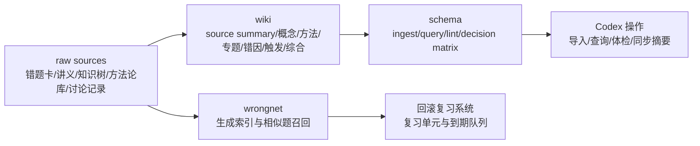

# 数学错题知识库总览

## 定位

本页是数学一错题系统的 wiki 总览。它把正式 wrongnet、一题一卡、方法论库、知识树、回滚系统和 LLM Wiki 编译层放在同一张图里。

## 系统分层

## 当前稳定页面类型

- source summary：[[SRC-RAW-SOURCES-MAP_原始资料映射]]、[[SRC-WRONGNET_正式错题卡源数据]]、[[SRC-METHOD-LIB_方法论库]]、[[SRC-AI-RULES_数学AI维护规则]]、[[SRC-SCHEMA_数学Wiki规则层]]
- concept：[[MATHWIKI-GS-CONCEPT-001_条件边界]]、[[MATHWIKI-GS-CONCEPT-002_积分结构中心]]
- method：[[MATHWIKI-GS-METHOD-001_先做条件边界清单]]、[[MATHWIKI-GS-METHOD-002_换元合法性三件套]]、[[MATHWIKI-GS-METHOD-003_整体函数奇偶性检查]]、[[MATHWIKI-GS-METHOD-004_分段点与上限变量排序]]、[[MATHWIKI-GS-METHOD-005_凑微分后的整体变量链]]、[[MATHWIKI-GS-METHOD-006_先判型总流程]]、[[MATHWIKI-GS-METHOD-007_条件转化总流程]]、[[MATHWIKI-GS-METHOD-008_分类讨论闭环]]、[[MATHWIKI-GS-METHOD-009_B3-METHOD方法调取断点]]、[[MATHWIKI-GS-METHOD-010_B4-CHAIN动作链断点]]、[[MATHWIKI-GS-METHOD-011_B5-CHECK检查断点]]、[[MATHWIKI-GS-METHOD-012_等价无穷小使用条件]]、[[MATHWIKI-GS-METHOD-013_导数定义差商入口]]
- topic：[[MATHWIKI-GS-TOPIC-001_条件边界与分类讨论]]、[[MATHWIKI-GS-TOPIC-002_一元积分近期错题簇]]、[[MATHWIKI-GS-TOPIC-003_高频知识主线总览]]、[[MATHWIKI-GS-TOPIC-004_极限与连续错题总线]]、[[MATHWIKI-GS-TOPIC-005_一元函数微分学应用错题总线]]、[[MATHWIKI-GS-TOPIC-006_定积分错题总线]]、[[MATHWIKI-GS-TOPIC-007_数列极限错题总线]]、[[MATHWIKI-GS-TOPIC-008_高等数学综合待精分分流台]]、[[MATHWIKI-GS-TOPIC-009_微分方程错题总线]]、[[MATHWIKI-GS-TOPIC-010_多元函数与二重积分错题总线]]、[[MATHWIKI-GS-TOPIC-011_无穷级数与幂级数错题总线]]、[[MATHWIKI-GS-TOPIC-012_空间解析几何错题总线]]、[[MATHWIKI-GS-TOPIC-013_不定积分与三角有理式错题总线]]、[[MATHWIKI-LA-TOPIC-001_线代矩阵运算错题总线]]、[[MATHWIKI-LA-TOPIC-002_线代综合待精分分流台]]、[[MATHWIKI-LA-TOPIC-003_线性方程组与向量组错题总线]]、[[MATHWIKI-LA-TOPIC-004_二次型与特征结构错题总线]]
- error pattern：[[MATHWIKI-GS-ERROR-001_边界条件遗漏]]、[[MATHWIKI-GS-ERROR-002_只看局部不看整体]]、[[MATHWIKI-GS-ERROR-003_方法选择错误]]、[[MATHWIKI-GS-ERROR-004_过程跳步]]、[[MATHWIKI-GS-ERROR-005_题型识别失败]]
- trigger：[[MATHWIKI-GS-TRIGGER-001_参数端点定义域先停]]、[[MATHWIKI-GS-TRIGGER-002_积分先找中心与整体]]、[[MATHWIKI-GS-TRIGGER-003_整体平方差先设整体]]
- synthesis：[[MATHWIKI-SYNTHESIS-001_当前高价值错因与方法缺口]]
- question/queue：[[MATHWIKI-QUESTIONS-001_待调查问题与素材队列]]

## 当前知识主线

1. 正式错题系统继续以 `错题卡/*.md` 为源数据。
2. LLM Wiki 不复制完整题解，只编译可复用模式。
3. 最近最稳定的高价值主线是“条件边界与分类讨论”。
4. 一元积分近期错题簇已经拆出积分结构中心、换元合法性、整体奇偶性、分段点排序、凑微分后的整体变量链和“只看局部不看整体”错因页。
5. method_gap 是把错题卡、方法论库和 wiki 方法页连起来的关键桥。
6. 全量 749 张正式错题卡已经从 source summary 连到知识点簇、方法簇、错因簇、action_gap 簇，并进一步接到概念、方法、专题、错因、触发或综合页。
7. Obsidian 根目录已有[[00-数学一LLMWiki入口]]，打开 vault 后可以直接进入 LLM Wiki 而不是从目录里找 `wiki/`。

## 下一步编译方向

- 把 `高数讲义/`、`线代讲义/`、`概率论讲义/` 中已学习章节逐步建 source summary。
- 继续沿一元积分簇扩展 `GS-618`、`GS-619`、`GS-620` 等根式/三角换元后续动作链，并把一元积分簇接入 Tutor 候选。
- 把方法论库中的高频 method_gap 映射到 wiki 方法页和触发页。
- 继续把粗标签分流页升级为更细概念、方法、错因和触发页，优先从[[MATHWIKI-GS-TOPIC-008_高等数学综合待精分分流台]]、[[MATHWIKI-LA-TOPIC-002_线代综合待精分分流台]]和高频缺 method_gap 的卡片推进。
- 对 `wiki/index.md` 中 `unprocessed` source 定期清理。
