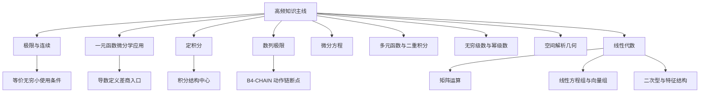

# 高频知识主线总览

本页把全量错题卡里的高频 `knowledge` 簇推进为可浏览的专题主线。它不是错题清单，而是从错题清单中抽出复盘入口。

## 主线图

## 核心入口

- [[MATHWIKI-GS-TOPIC-004_极限与连续错题总线]]：先判未定式、主导项、等价条件、左右边界。
- [[MATHWIKI-GS-TOPIC-005_一元函数微分学应用错题总线]]：从导数定义、函数形态、单调极值和中值定理入口整理。
- [[MATHWIKI-GS-TOPIC-006_定积分错题总线]]：从区间、变量、换元、分段、对称和反常点整理。
- [[MATHWIKI-GS-TOPIC-007_数列极限错题总线]]：从递推、单调有界、作差、夹逼和对数化整理。
- [[MATHWIKI-GS-TOPIC-008_高等数学综合待精分分流台]]：把粗标签继续分流到具体高数章节和方法页。
- [[MATHWIKI-GS-TOPIC-009_微分方程错题总线]]：从方程类型、标准型、通解骨架和条件代入整理。
- [[MATHWIKI-GS-TOPIC-010_多元函数与二重积分错题总线]]：从点、方向、区域、边界和线性主部整理。
- [[MATHWIKI-GS-TOPIC-011_无穷级数与幂级数错题总线]]：从通项、首项、下标、收敛区间和端点整理。
- [[MATHWIKI-GS-TOPIC-012_空间解析几何错题总线]]：从点、线、面、方向向量和法向量整理。
- [[MATHWIKI-GS-TOPIC-013_不定积分与三角有理式错题总线]]：从凑微分、分式拆分、三角代换和回代整理。
- [[MATHWIKI-LA-TOPIC-001_线代矩阵运算错题总线]]：从维数、顺序、秩和特征结构整理。
- [[MATHWIKI-LA-TOPIC-002_线代综合待精分分流台]]：把线代粗标签继续分流到矩阵、方程组、向量组、二次型。
- [[MATHWIKI-LA-TOPIC-003_线性方程组与向量组错题总线]]：从秩、自由变量、解空间和线性相关整理。
- [[MATHWIKI-LA-TOPIC-004_二次型与特征结构错题总线]]：从对称矩阵、标准形、正定性和特征值整理。

## 连接的索引型簇

- [[MATHWIKI-KNOWLEDGE-001_一元函数微分学应用]]
- [[MATHWIKI-KNOWLEDGE-002_极限与连续]]
- [[MATHWIKI-KNOWLEDGE-003_定积分]]
- [[MATHWIKI-KNOWLEDGE-004_等价无穷小]]
- [[MATHWIKI-KNOWLEDGE-005_数列极限]]
- [[MATHWIKI-KNOWLEDGE-010_无穷级数]]
- [[MATHWIKI-KNOWLEDGE-014_多元函数微分学]]
- [[MATHWIKI-KNOWLEDGE-019_微分方程]]
- [[MATHWIKI-KNOWLEDGE-028_二次型]]
- [[MATHWIKI-KNOWLEDGE-030_线性方程组]]
- [[MATHWIKI-KNOWLEDGE-031_线性代数综合待精分]]

## 稳定判断

- 这些高频簇不能直接当作强关联依据，强关联仍要看细知识点、方法入口、错因和专题链。
- wiki 的价值在于把这些簇继续编译成“看到什么信号，第一步做什么”的方法页。
- 如果一个错题只连到本页或知识点簇，说明它已经进入 LLM Wiki 框架，但仍需要后续深度编译。

## 相关方法页

- [[MATHWIKI-GS-METHOD-006_先判型总流程]]
- [[MATHWIKI-GS-METHOD-007_条件转化总流程]]
- [[MATHWIKI-GS-METHOD-008_分类讨论闭环]]
- [[MATHWIKI-GS-METHOD-009_B3-METHOD方法调取断点]]
- [[MATHWIKI-GS-METHOD-010_B4-CHAIN动作链断点]]
- [[MATHWIKI-GS-METHOD-011_B5-CHECK检查断点]]
